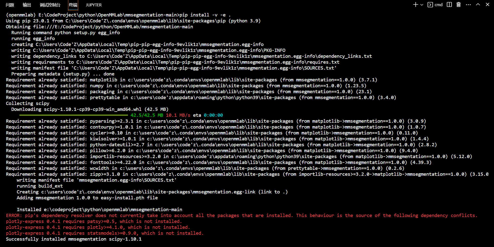
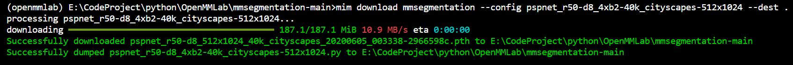
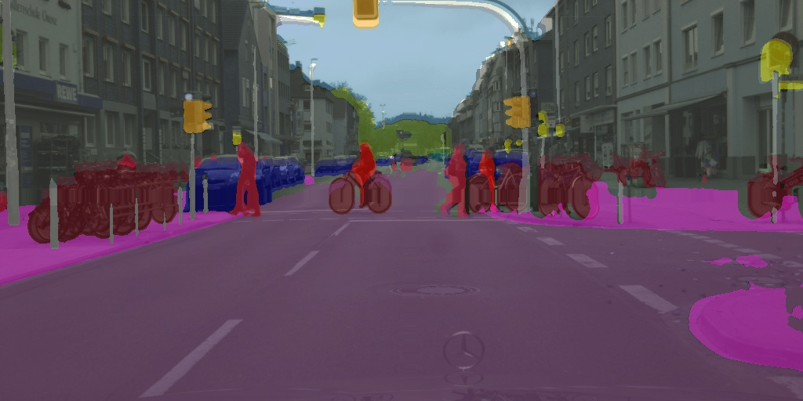

# MMsegmentation第一步
---
[官方文档](https://mmsegmentation.readthedocs.io/zh_CN/latest/get_started.html)
## 通过源码安装MMSegmentation
```shell{.line-numbers}
git clone -b main https://github.com/open-mmlab/mmsegmentation.git
cd mmsegmentation
pip install -v -e .
```


> 后来又在jupter中用魔法命令安装了一次（删除项目重新clone），详细输出结果见文件夹`☆My-try\first_try.ipynb`的输出信息
## demo运行
### 步骤 1. 下载配置文件和模型文件
```shell{.line-numbers}
mim download mmsegmentation --config pspnet_r50-d8_4xb2-40k_cityscapes-512x1024 --dest .
```
下载结束，看到以下两个文件在根目录：`pspnet_r50-d8_4xb2-40k_cityscapes-512x1024.py` 和 `pspnet_r50-d8_512x1024_40k_cityscapes_20200605_003338-2966598c.pth`

> **注**：后来发现`configs/pspnet/`目录下`pspnet_r50-d8_4xb2-40k_cityscapes-512x1024.py`已经有了，所以下载到根目录的的模型文件可以删除，保留配置文件`pspnet_r50-d8_512x1024_40k_cityscapes_20200605_003338-2966598c.pth`即可，统一保留到`checkpoints`文件夹下（迁移新项目后，统一放到`☆My-try\download`）

**公开课的操作**：（wget是Linux的操作，windows不可用，只是参考文件管理方式）
```shell{.line-numbers}
mkdir checkpoints
wget https://download.openmmlab.com/mmsegmentation/v0.5/pspnet/pspnet_r50-d8_512x1024_40k_cityscapes/pspnet_r50-d8_512x1024_40k_cityscapes_20200605_003338-2966598c.pth -P checkpoints
```
### 步骤 2. 验证推理 demo
```shell{.line-numbers}
python demo/image_demo.py demo/demo.png configs/pspnet/pspnet_r50-d8_4xb2-40k_cityscapes-512x1024.py checkpoints/pspnet_r50-d8_512x1024_40k_cityscapes_20200605_003338-2966598c.pth --device cuda:0 --out-file result.jpg
```
运行结果：
